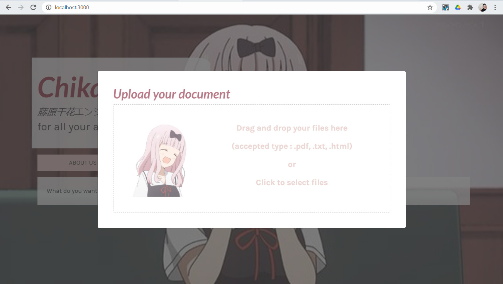
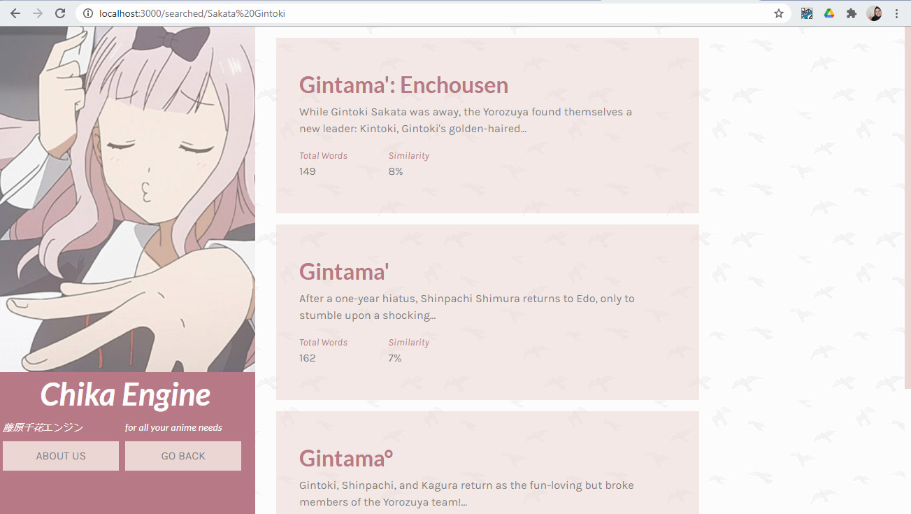

# Chika Engine 
> A search engine for searching the latest informations for anime, manga, and so on.\
> [Spesifikasi Tubes](https://drive.google.com/file/d/1YThhhPhrX3xce4vwtH8fGhKR4euv_HSX/view) | [Laporan](https://docs.google.com/document/d/1wVcsBjCHXk4DWX5mus3BnXL9-69UUYrisBg9_Wo6zrI/edit?ts=5f9bc110)

## Table of contents
* [Informasi_umum](#informasi-umum)
* [Screenshots](#screenshots)
* [Teknologi](#teknologi)
* [Setup](#setup)
* [Contoh kode](#contoh-kode)
* [Fitur](#fitur)
* [Status](#status)
* [Inspirasi](#inspirasi)
* [Kontak](#kontak)

## Informasi Umum
Chika Engine adalah search engine yang dirancang untuk memenuhi salah satu tugas besar mata kuliah di Teknik Informatika, yaitu Aljabar Linear dan Geometri. Search engine yang dirancang menggunakan kalkulasi TF-IDF (*Term Frequency-Inverse Document Frequency*) dan *cosine similarity*. Chika Engine dirancang oleh 3 mahasiswa Teknik Informatika angkatan 2019, yaitu Jason Stanley Yoman (13519019), Shaffira Alya Mevia (13519083), dan Cynthia Rusadi (13519118).

## Screenshots

Landing Page Chika Engine

Upload Dokumen


## Teknologi
* Bootstrap
* Node
* NPM
* Python
* BeautifulSoup
* NLTK
* Numpy
* ReactJS

## Setup
Clone repository 
```sh
git clone https://github.com/jasonstanleyyoman/Algeo02-19019.git
```
#### Install semua dependencies
##### Backend
Pengguna diharapkan sudah menginstall python3 dan pip3 di mesinnya. Jika belum silahkan kunjungi laman berikut untuk panduan instalasinya
<br/>
[Instalasi python3 dan pip3](https://www.python.org/downloads/)
<br/>
Setelah itu install dependencies pythonnya dengan cara yang disesuaikan dengan sistem operasi yang Anda gunakan
- [Flask](https://flask.palletsprojects.com/en/1.1.x/installation/)
- [BeautifulSoup4](https://pypi.org/project/beautifulsoup4/)
- [nltk](https://www.nltk.org/install.html)
Setalah menginstall nltk, Anda perlu menginstall beberapa package stopwords dan punkt di nltk.
<br/>
--- Masuk ke Interpreter python Anda. Bisa menggunakan salah satu dari command ini :
```sh
python3
```
```sh
python
```
```sh
py.exe
```
--- Setelah itu download package nltk
```python
>>> import nltk
>>> nltk.download()
```
Jika Anda dihadapkan dengan GUI untuk download serperti dibawah ini, cari package bernama stopwords dan punkt dan lakukan download

Jika tidak, jalankan command ini
```python
>>> d punkt
>>> d stopwords
```
- [numpy](https://numpy.org/install/)
- [pdftotext](https://pypi.org/project/pdftotext/)
- [requests](https://requests.readthedocs.io/en/master/user/install/#install)

<br/>
Setelah semua dependencies berhasil diinstall, jalankan backend dengan menggunakan command ini
<br/>

```sh
python3 Algeo02-19019/src/server/app.py
```

**Jika tidak terjadi apa-apa, maka jalankan command dengan menggantikan python3 dengan python atau py**
##### Frontend
Pengguna diharapkan sudah menginstall nodejs dan package manager (npm atau yarn) di mesinnya. Jika belum silahkan kunjungi laman berikut untuk panduan instalasinya

[Node JS](https://nodejs.org/en/download/)
[yarn](https://classic.yarnpkg.com/en/docs/install/#debian-stable)

Jalankan frontend dengan menggunakan command ini
```sh
cd Algeo02-19019/src/chika-engine
npm install # yarn install jika menggunakan yarn
npm start
```

## Contoh kode
#### Web Scraping
Repository ini sudah menyediakan data hasil web scrapping untuk digunakan. Tetapi, jika Anda ingin mengambil data dengan web scrapping lagi, jalankan command ini
```sh
python3 Algeo02-19019/src/server/web-scrapping/web-scrapper.py ${JumlahDokumen} # Ganti ${JumlahDokumen} dengan jumlah dokumen yang ingin diambil
```
Contoh :
```sh
python3 Algeo02-19019/src/server/web-scrapping/web-scrapper.py 30
```

Setelah itu jalankan command di bawah untuk memproses data yang diambil
```sh
python3 Algeo02-19019/src/server/preprocess.py
python3 Algeo02-19019/src/server/total_words.py
python3 Algeo02-19019/src/server/get_15_word.py
```
**Jika tidak terjadi apa-apa, maka jalankan command dengan menggantikan python3 dengan python atau py**

## Fitur
Fitur yang dapat digunakan:
* Upload dokumen via drag and drop
* Menggunakan search bar
* Menampilkan *ranking* dokumen berdasarkan *query*
* GIF saat *loading*
* Fujiwara Chika

To-do list:
- [x] Web Scraping 
- [x] Backend
- [x] Frontend

## Status
Project is: _in progress_

## Inspirasi
Projek ini dirancang untuk memenuhi salah satu tugas besar mata kuliah IF2123 Aljabar Linear dan Geometri.

## Kontak
Created by [@jasonstanleyyoman](https://github.com/jasonstanleyyoman), [@cyn-rus](https://github.com/cyn-rus), and [@salyamevia](https://github.com/salyamevia).